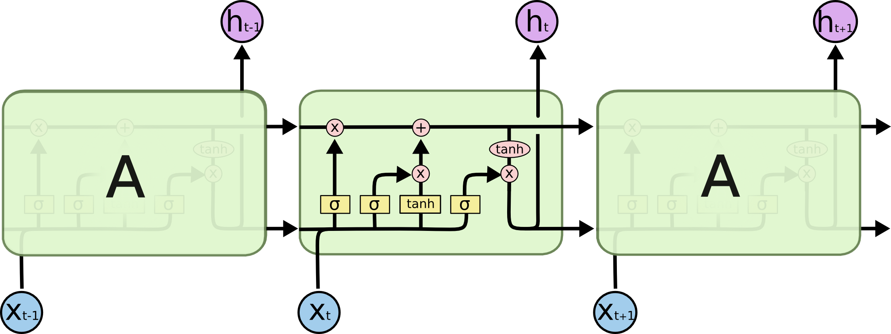

# Named Entity Recognition using LSTM
> In this project, I have use the Keras API with TensorFlow as its backend to build and train a bidirectional LSTM neural network model to recognize named entities in text data. Named entity recognition models can be used to identify mentions of people, locations, organizations, etc. Named entity recognition is not only a standalone tool for information extraction, but it also an invaluable preprocessing step for many downstream natural language processing applications like machine translation, question answering, and text summarization. 

## What is Named Entity Recognation?
> Named-entity recognition (NER) is a subtask of information extraction that seeks to locate and classify named entities mentioned in unstructured text into pre-defined categories such as person names, organizations, locations, medical codes, time expressions, quantities, monetary values, percentages, etc.
[Source](https://en.wikipedia.org/wiki/Named-entity_recognition)

## What is LSTM?
> Long short-term memory is an artificial recurrent neural network architecture used in the field of deep learning. Unlike standard feedforward neural networks, LSTM has feedback connections. It can not only process single data points, but also entire sequences of data.
[Source](https://en.wikipedia.org/wiki/Long_short-term_memory)

## What is bidirectinal LSTM?
> Bidirectional Recurrent Neural Networks connect two hidden layers of opposite directions to the same output. With this form of generative deep learning, the output layer can get information from past and future states simultaneously.
[Source](https://en.wikipedia.org/wiki/Bidirectional_recurrent_neural_networks)

